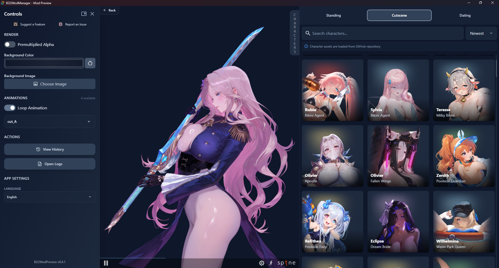

# Brown Dust 2 Mod Manager

> 🛠 Easily manage, preview, and sync mods for Brown Dust 2.
> 
> 🎉 **Download the latest version:** [GitHub Releases](https://github.com/bruhnn/BD2ModManager/releases/latest)
>
> 🚧 Work in progress V4.0.0 [Issue #31](https://github.com/bruhnn/BD2ModManager/issues/31)
> 
If you have suggestions or run into any problems with the app, feel free to open an issue or contact me.

---

## ✨ Features

- Mod profiles to save and apply different enabled mod states
- Preview Spine animations  
- Automatic game detection  
- Auto-updates for new characters & assets  
- Multi-language support: en-US, pt-BR, ja-JP, ko-KR, zh-CN  
- Easy mod management: search, filter, install, enable/disable

---

## 🛠️ How to Use

1. **Download** the app from [GitHub Releases](https://github.com/bruhnn/BD2ModManager/releases).
2. **Select your Brown Dust 2 directory** (where `BrownDust II.exe` is located)
   - Example: F:\Neowiz\Browndust2\Browndust2_10000001
3. **Add your mods** by:
   - Dragging and dropping them into the Mod Manager  
   - Or moving them into the `mods/` folder  
     ⚠️ **Note:** This is *not* the BrownDustX `mods` directory. It's a separate folder used by this manager

4. **Enable or disable mods**.
5. **Sync your mods** to apply changes:
   - This will create a folder named `BD2MM` inside the `BrownDustX` mods folder with all your enabled mods.

> ⚠️ After making any changes (enable, disable, delete, rename), you **must sync** your mods to update the game folder.

### Sync Method: Copy vs Symlink

Choose how mods are synced to your BrownDust X `mods` folder:

#### 📁 Copy  
Copies all enabled mods into the folder.  

- ✅ No admin rights needed  
- ❌ Slower  
- ❌ Uses more disk space  

#### 🔗 Symlink  
Creates shortcuts instead of copying files.  

- ✅ Much faster  
- ✅ Saves disk space  
- ❌ Requires admin rights  
- ❌ Drag & Drop not available (Windows restrictions)  

### Example Comparison with 359 mods

| Copy | Symlink |
|--------|-------|
|  |  |

---

## 📸 Screenshots

### Mods Page (v3.1.0)

### Characters Page (v3.1.0)

### Mod Preview (BD2ModPreview v0.4.1)

---
## 🧰 Community & Related Projects  

- [**BD2 Mod Manager (by kxdekxde)**](https://codeberg.org/kxdekxde/browndust2-mod-manager) – Alternative mod manager
- [**BD2 Live2D Viewer (by jelosus2)**](https://github.com/Jelosus2/BD2-L2D-Viewer) – Website to preview character animations  

## ❓ FAQ

### Where can I get mods?
You can find mods on the BrownDustX Discord server: [https://discord.gg/B3Aqz6tDG2](https://discord.gg/B3Aqz6tDG2)

### Why is the `.exe` flagged as a virus?
This is a **false positive** caused by how PyInstaller packages apps. The program does **not** contain any malware.  
If you're unsure, you can check the [source code](https://github.com/bruhnn/BD2ModManager) and build the `.exe` yourself.

### What's the difference between the `.exe` and the `*-Full.zip` version?
- The `.exe` is a standalone, single-file version.
- The `*-Full.zip` is the **full version**, containing all required files and less likely to trigger false positives. It's recommended if you run into issues with the single `.exe`.

## 🤝 Credits

- Character assets by [myssal/Brown-Dust-2-Asset](https://github.com/myssal/Brown-Dust-2-Asset)
- Thanks to **Synae** for *Brown Dust X*

## Star History

<a href="https://www.star-history.com/#bruhnn/BD2ModManager&Date">
 <picture>
   <source media="(prefers-color-scheme: dark)" srcset="https://api.star-history.com/svg?repos=bruhnn/BD2ModManager&type=Date&theme=dark" />
   <source media="(prefers-color-scheme: light)" srcset="https://api.star-history.com/svg?repos=bruhnn/BD2ModManager&type=Date" />
   
 </picture>
</a>
